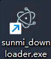

# 
固件编译与下载

## 
目录

1. [SP固件编译与下载](#SP固件编译与下载)  
1. [TOSS固件下载错误](#TOSS固件下载错误)

---

## SP固件编译与下载  

SP固件烧录通常有两种方式：`串口直接下载`和`libbase打包USB下载`

### 串口直接下载  

以`liteos_px`为例，运行对应的编译bat文件后，将文件`P2_LiteOS_Vx.x.xx_xxxxxxxx.bin`签名后，使用sunmi_downloader.exe，链接串口下载即可  

*注意事项：使用串口直接下载时，SP固件版本号应与机器libbase打包的固件版本号**相同**，否则会被libbase打包固件覆盖*

### libbase打包USB下载  

运行对应bat后，将对应芯片型号的`XXX_Firmware.bin`签名后，删去后缀`.bin.sig`,放入`libbase\fw`文件夹中替换，在运行libbase的`build.bat`，最后将得到的`libbase_Vx.x.xx_xxxxxxxx.so`签名后通过USB将机器连接SunmiDownloader.exe软件后下载即可 

*注意事项：libbase打包USB下载时，libbase版本号和机器**不能相同*** 

---

## TOSS固件下载错误

### 场景:

#### 设备: TOSS  

#### 软件：sunmi_downloader.exe

#### 现象：  

TOSS下载到百分之70左右时，提示`firmware通讯端口操作错误`

### 解决办法：  

安装`冰箱`APP，冻结L1服务`SunmiPayHardwareService`后再安装，下载完成解冻

##### 配置与安装：

>文件名称：  
>`icebox_coolapk_3.21.128141529-20219-o_1e9029q2s1emp178v1oud1bt3qeer-uid-184454.apk`   
>安装命令：  
>adb install -t -r [file]  
>配置命令：  
>adb shell dpm set-device-owner com.catchingnow.icebox/.receiver.DPMReceiver  

---
[Go top](#固件编译与下载)